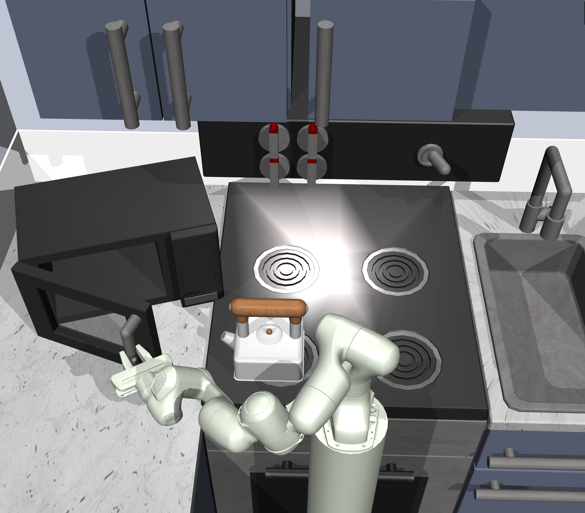
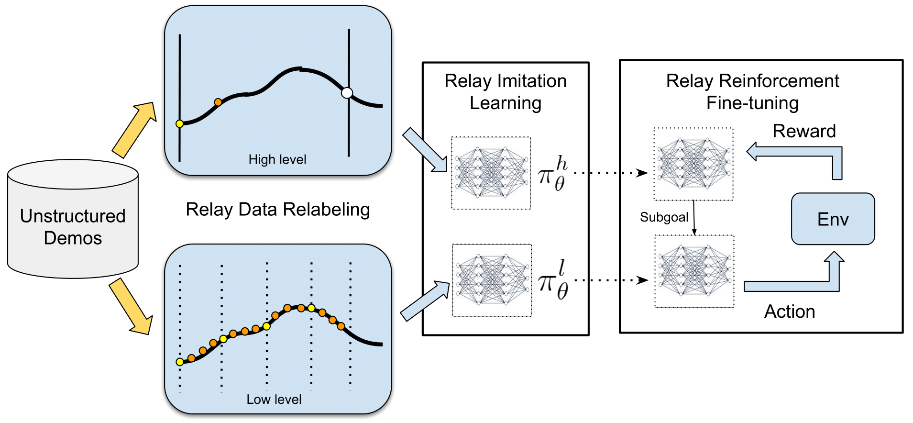
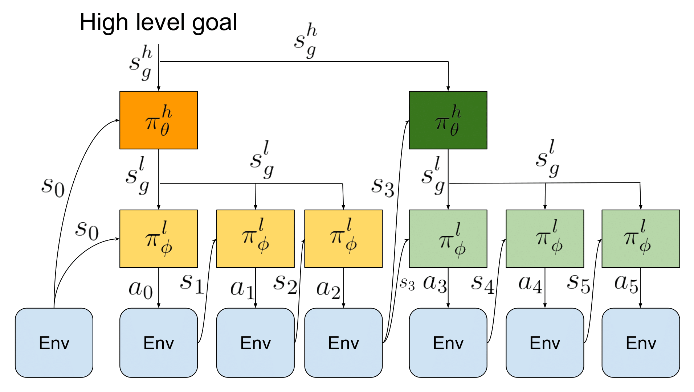

## Abstract

We present relay policy learning, a method for imitation and reinforcement learning that can solve multi-stage, long-horizon robotic tasks. 
This general and universally-applicable, two-phase approach consists of an imitation learning stage resulting in goal-conditioned hierarchical policies that can be easily improved using fine-tuning via reinforcement learning in the subsequent phase.
Our method, while not necessarily perfect at imitation learning, is very amenable to further improvement via environment interaction allowing it to scale to challenging long-horizon tasks.
In particular, we simplify the long-horizon policy learning problem by using a novel data-relabeling algorithm for learning goal-conditioned hierarchical policies, where the low-level only acts for a fixed number of steps, regardless of the goal achieved.
While we rely on demonstration data to bootstrap policy learning, we do not assume access to demonstrations of specific tasks. 
Instead, our approach can leverage unstructured and unsegmented demonstrations of semantically meaningful behaviors that are not only less burdensome to provide, but also can greatly facilitate further improvement using reinforcement learning. 
We demonstrate the effectiveness of our method on a number of multi-stage, long-horizon manipulation tasks in a challenging kitchen simulation environment.

[here]: https://learning-from-play.github.io

______

## Introduction

<figcaption>
Figure 2. RPL learns complex, long-horizon manipulation tasks in a simulated kitchen environment
</figcaption>

Recent years have seen reinforcement learning (RL) successfully applied to a number of robotics tasks such as in-hand 
manipulation(<dt-cite key="vikashICRA2016">Kumar et al.</dt-cite>), grasping(<dt-cite key="qtopt">Kalashnikov et al.</dt-cite>) 
and door opening (<dt-cite key="shaneDDPG">Gu et al.</dt-cite>). However, these applications have been largely constrained 
to relatively simple short-horizon skills. Hierarchical reinforcement learning (HRL) (<dt-cite key="hrlreview">Mahadevan et al.</dt-cite>) 
has been proposed as a potential solution that should scale to challenging long-horizon problems, by explicitly introducing 
temporal abstraction. However, HRL methods have traditionally struggled due to various practical challenges such as 
exploration(<dt-cite key="hdqn">Kulkarni et al.</dt-cite>), skill segmentation(<dt-cite key="options">Singh et al.</dt-cite>) 
and reward definition(<dt-cite key="diayn">Eysenbach et al.</dt-cite>). 

We can simplify the above-mentioned problems by utilizing extra supervision in the form of unstructured human demonstrations, 
in which case the question becomes: how should we best use this kind of demonstration data to make it easier to solve long-horizon robotics tasks? 

This question is one focus area of hierarchical imitation learning (HIL), where 
solutions(<dt-cite key="SWIRL">Krishnan et al.</dt-cite>, <dt-cite key="DDO">Fox et al.</dt-cite>) typically 
try to achieve two goals: i) learn a temporal task abstraction, and ii) discover a meaningful segmentation of the demonstrations into subtasks.
These methods have not traditionally been tailored to further RL fine-tuning, making it challenging to apply them to a 
long-horizon setting, where pure imitation is very likely to fail. To address this need, we devise a simple and 
universally-applicable two-phase approach that in the first phase pre-trains hierarchical policies using demonstrations 
such that they can be easily fine-tuned using RL during the second phase.
In contrast to HRL methods, our method takes advantage of unstructured demonstrations to bootstrap further fine-tuning, 
and in contrast to conventional HIL methods, it does not focus on careful subtask segmentation, making the method simple, general and very amenable to further reinforcement fine-tuning. In particular, we show that we can develop an imitation and reinforcement learning approach that while not necessarily perfect at imitation learning, is very amenable to improvement via fine-tuning with reinforcement learning and that can be scaled to challenging long-horizon manipulation tasks.

First, the approach is very general, in that it can be applied to any demonstration data, including easy to provide
 unsegmented, unstructured and undifferentiated demonstrations of meaningful behaviors. Second, our method does not 
 require any explicit form of skill segmentation or subgoal definition, which otherwise would need to be learned or 
 explicitly provided. Lastly, and most importantly, since our method ensures that every low-level trajectory is 
 goal-conditioned (allowing for a simple reward specification) and of the same, limited length, it is very amenable to 
 reinforcement fine-tuning, which allows for continuous policy improvement. We show that relay policy learning allows us 
 to learn general, hierarchical, goal-conditioned policies that can solve long-horizon manipulation tasks in a 
 challenging kitchen environment in simulation, while significantly outperforming hierarchical RL algorithms 
 and imitation learning algorithms.

## Preliminaries
**Goal-conditioned reinforcement learning**: We define $\mathcal{M} = (S, A, P, r)$ to be a finite-horizon Markov 
decision process (MDP), where $S$ and $A$ are state and action spaces, $P(s_{t+1} \mid s_t, a_t)$ is a transition function, 
$r$ a reward function. The goal of RL is to find a policy $\pi(a | s)$ that maximizes expected reward over trajectories 
induced by the policy: $\mathbb{E}_{\pi}[\sum_{t=0}^T \gamma^t r_i(s_t, a_t)]$. To extend RL to multiple tasks, 
a goal-conditioned formulation (~\cite{kaelbling}) can be used to learn a policy $\pi(a | s, s_g)$ which maximizes the 
expected reward $r(a, s, s_g)$ with respect to a goal distribution $s_g \sim \mathcal{G}$ as 
follows: $\mathbb{E}_{s_g\sim\mathcal{G}} [\mathbb{E}_{\pi}[\sum_{t=0}^T \gamma^t r_i(s_t, a_t, s_g)]]$. 

**Goal-conditioned imitation learning**: In typical imitation learning, instead of knowing the reward $r$, the agent 
has access to demonstrations $\mathcal{D}$ containing a set of trajectories $\mathcal{D} = \{\tau^i, \tau^j, \tau^k, \}$ 
of state-action pairs $\tau^i = \{s_0^i, a_0^i, ..., s_T^i, a_T^i\}$. The goal is to learn a policy $\pi(a|s)$ that 
imitates the demonstrations. A common approach is to maximize the likelihood of actions in the demonstration, 
i.e. $\max E_{(s, a) \sim \mathcal{D}} \log\pi(a|s)$, referred to as behavior cloning (BC). When there are multiple 
demonstrated tasks, we consider a goal-conditioned imitation learning setup where the dataset of demonstrations 
$\mathcal{D}$ contains sequences that attempt to reach different goals $s_g^i, s_g^j, s_g^k, ...$. 
The objective is to learn a goal-conditioned policy $\pi(a|s, s_g)$ that is able to reach different goals 
$s_g$ by imitating the demonstrations. 

## Relay Policy Learning

In this section, we describe our proposed relay policy learning (RPL) algorithm, which leverages unstructured demonstrations 
and reinforcement learning to solve challenging long-horizon tasks. 
Our approach consists of two phases: relay imitation learning (RIL), followed by relay reinforcement fine-tuning (RRF) 
described below. While RIL by itself is not able to solve the most challenging tasks that we consider, 
it provides a very effective initialization for fine-tuning. 

<figcaption>
Figure 3. Relay policy learning: the algorithm starts with relabelling unstructured demonstrations at both the high and the low level of the hierarchical policy and then uses them to perform relay imitation learning. 
    This provides a good policy initialization for subsequent relay reinforcement fine-tuning. 
    We demonstrate that learning such simple goal-conditioned policies at both levels from demonstrations using relay data relabeling, combined with relay reinforcement fine-tuning allows us to learn complex manipulation tasks.
</figcaption>

**Relay Policy Architecture**

We first introduce our bi-level hierarchical policy architecture (shown in Fig 4, which enables us to leverage temporal abstraction. 
This architecture consists of a high-level goal-setting policy and a low-level subgoal-conditioned policy, which together 
generate an environment action for a given state. 
The high-level policy $\pi_{\theta}^{h}(s_g^l|s_t, s_g^h)$ takes the current state $s_t$ and a long-term high-level goal 
$s_g^h$ and produces a subgoal $s_g^l \in \mathcal{S}$ which is then ingested by a low-level policy $\pi_{\phi}^{l}(a|s_t, s_g^l)$. 
The low-level policy takes the current state $s_t$, and the subgoal $s_g^{l}$ commanded by the high-level policy and 
outputs an action $a_t$, which is executed in the environment. 

<figcaption>
Figure 4. Relay Policy Architecture: A high level goal setter $\pi_{\theta}$ takes high level goal $s_g^h$ and 
sets goals $s_g^l$ for a lower level policy $\pi_{\phi}$, which acts for a fixed time horizon before resampling $s_g^l$
</figcaption>

Importantly, the goal setting policy $\pi_{\theta}^{h}$ makes a decision every $H$ time steps (set to $30$ in our experiments), 
with each of its subgoals being kept constant during that period for the low-level policy, while the low-level policy 
$\pi_{\phi}^{l}$ operates at every single time-step. 
This provides temporal abstraction, since the high level policy operates at a coarser resolution than the low-level policy. 
This policy architecture, while inspired by goal-conditioned HRL algorithms~\cite{HIRO}, requires a novel learning 
algorithm to be applicable in the context of imitation learning, which we describe in the Relay Imitation Learning section. Given a high-level 
goal $s_g^h$, $\pi_{\theta}^{h}$ samples a subgoal $s_{g_0}^l$, which is passed to $\pi_{\theta}^{l}$ to generate action 
$a_0$. For the subsequent $H$ steps, the goal produced by $\pi_{\theta}^{h}$ is kept fixed, while $\pi_{\theta}^{l}$ 
generates an action $a_t$ at every time step. 

**Relay Imitation Learning**

Our problem setting assumes access to a pool of unstructured, unlabelled demonstrations $\mathcal{D}$ that correspond to 
meaningful activities provided by the user, without any particular task in mind, e.g. opening cabinet doors, 
playing with different objects, or simply tidying up the scene. 
We do not assume that this demonstration data actually accomplishes any of the final task goals that we will need to solve 
at test-time, though we do need to assume that the test-time goals come from the same distribution of goals as those accomplished in the demonstration data.
In order to take the most advantage of such data, we initialize our policy with our proposed relay imitation learning (RIL) algorithm. 
RIL is a simple imitation learning procedure that uses goal relabeling and hierarchical policy decomposition which result 
in improved handling of multi-task generalization and compounding error. RIL assumes access to the pool of demonstrations 
(as described in ~\citet{LMP}) consisting of $N$ trajectories $\mathcal{D} = \{\tau^i, \tau^j, \tau^k, ...\}$, where 
each trajectory consists of state-action pairs $\tau^i = \{s_0^i, a_0^i, \dots, s_T^i, a_T^i\}$. 
Importantly, these demonstrations can be attempting to reach a variety of different high level goals $s_g^h$, but we do 
not require these goals to be specified explicitly. To learn the relay policy from these demonstrations, we construct 
a low-level dataset $\mathcal{D}_l$, and a high-level dataset $\mathcal{D}_h$ from these demonstrations via ``relay data relabeling",
 which is described below, and use them to learn $\pi_{\theta}^{h}$ and $\pi_{\theta}^{l}$ via supervised learning at multiple levels. 

We construct the low-level dataset by iterating through the pool of demonstrations and relabeling them using our 
relay data relabelling algorithm. First, we choose a window size $W_{l}$ and generate state-goal-action tuples for 
$\mathcal{D}_l$, $(s, s_g^l, a)$ by goal-relabeling within a sliding window along the demonstrations, as described 
in detail below and in Algorithms~\ref{alg:ril_relabellow},~\ref{alg:ril_relabelhigh}. 
The key idea behind relay data relabeling is to consider all states that are actually reached along a demonstration 
trajectory within $W_{l}$ time steps from any state $s_t$ to be goals reachable from the state $s_t$ by executing action $a_t$. 
This allows us to label all states $s_{t+1}, ...., s_{t + W_{l}}$ along a valid demonstration trajectory as potential 
goals that are reached from state $s_t$, when taking action $a_t$. 
We repeat this process for all states $s_t$ along all the demonstration trajectories being considered. 
This procedure ensures that the low-level policy is proficient at reaching a variety of goals from different states, 
which is crucial when the low-level policy is being commanded potentially different goals generated by the high-level policy. 

We employ a similar procedure for the high level, generating the high-level state-goal-action dataset $\mathcal{D}_h$. 
We start by choosing a high-level window size $W_h$, which encompasses the high-level goals we would like to eventually reach. 
We then generate state-goal-action tuples for $\mathcal{D}_h$, via relay data relabeling within the high-level window being 
considered, as described in Algorithm~\ref{alg:ril_relabellow},~\ref{alg:ril_relabelhigh}. 
We also label all states $s_{t+1}, ...., s_{t + W_{h}}$ along a valid trajectory as potential high-level goals that are 
reached from state $s_t$ by the high level policy, but we set the high-level action for a goal $j$ steps ahead $s_{t + j}$, 
as $s_{t + \min(W_l,  j)}$ choosing a sufficiently distant subgoal as the high-level action.  

Given these relay-data-relabeled datasets, we train $\pi_{\theta}^{l}$ and $\pi_{\theta}^{h}$ by maximizing the likelihood 
of the actions taken given the corresponding states and goals:
\begin{align}
\label{eqn:maxlikelihood}
&\max_{\phi, \theta} \mathbb{E}_{(s, a, s_g^l) \sim D_l}[\log \pi_{\phi}(a|s, s_g^l)] + \mathbb{E}_{(s, s_g^l, s_g^h) \sim D_h}[\log \pi_{\theta}(s_g^l|s, s_g^h)].
\end{align}
This procedure gives us an initialization for both the low-level and the high-level policies, without the requirement 
for any explicit goal labeling from a human demonstrator. 
Relay data relabeling not only allows us to learn hierarchical policies without explicit labels, but also provides algorithmic 
improvements to imitation learning: (i) it generates more data through the relay-data-relabelling augmentation, 
and (ii) it improves generalization since it is trained on a large variety of goals. 

**Relay Reinforcement Fine-tuning**

The procedure described in the above section allows us to extract an effective policy initialization via relay imitation learning. 
However, this policy is often unable to perform well across all temporally extended tasks, due to the well-known compounding errors stemming 
from imitation learning~\cite{dagger}. 
Reinforcement learning provides a solution to this challenge, by enabling continuous improvement of the learned policy 
directly from experience. We can use RL to improve RIL policies via fine-tuning on different tasks. We employ a goal-conditioned 
HRL algorithm that is a variant of natural policy gradient (NPG) with adaptive step size~\cite{TRPO}, where both the high-level 
and the low-level goal-conditioned policies $\pi_{\theta}^h$ and $\pi_{\phi}^l$ are being trained with policy gradient in a decoupled optimization. 

Given a low-level goal-reaching reward function $r_{l}(s_t, a_t, s_g^l)$, we can optimize the low-level policy by simply 
augmenting the state of the agent with the goal commanded by the high-level policy and then optimizing the policy to 
effectively reach the commanded goals by maximizing the sum of its rewards. 
For the high-level policy, given a high-level goal-reaching reward function $r_{h}(s_t, g_t, s_g^h)$, we can optimize 
it by running a similar goal-conditioned policy gradient optimization to maximize the sum of high-level rewards obtained 
by commanding the current low-level policy. 

To effectively incorporate demonstrations into this reinforcement learning procedure, we leverage our method via: 
(1) initializing both $\pi_{\theta}^{l}$ and $\pi_{\theta}^{h}$ with the policies learned via RIL, and (2) encouraging 
policies at both levels to stay close to the behavior shown in the demonstrations. 
To incorporate (2), we augment the NPG objective with a max-likelihood objective that ensures that policies at 
both levels take actions that are consistent with the relabeled demonstration pools $D_{l}$ and $D_{h}$ from 
Section~\ref{sec:ril}, as described below:  
\begin{align}
    \label{eqn:lowlevel}
    &\nabla_{\phi} J_l = \mathbb{E}[\nabla_{\phi}\log\pi_{\phi}^{l}(a|s,s_g^l) \sum_t r_{l}(s_t, a_t, s_g^l)] + \lambda_l\mathbb{E}_{(s,a,s_g^l) \sim \mathcal{D}_{l}}[\nabla_{\phi}\log\pi_{\phi}^{l}(a|s,s_g^l)]\\
    \label{eqn:highlevel}
    &\nabla_{\theta} J_h = \mathbb{E}[\nabla_{\theta}\log\pi_{\theta}^{h}(s_g^l|s,s_g^h) \sum_t r_{h}(s_t, s_g^l, s_g^h)] + \lambda_h\mathbb{E}_{(s,s_g^l,s_g^h) \sim \mathcal{D}_{h}}[\nabla_{\theta}\log\pi_{\theta}^{h}(s_g^l|s,s_g^h)].
\end{align}
While a similar objective has been described in~\cite{DAPG, ashvin}, it is yet to be explored in the hierarchical, 
goal-conditioned scenarios, which makes a significant difference as indicated in our experiments.

In addition, since we are learning goal-conditioned policies at both the low and high level, we can leverage relay 
data relabeling as described before to also enable the use of off-policy data for fine-tuning.
Suppose that at a particular iteration $i$, we sampled $N$ trajectories according to the scheme proposed in Sec.~\ref{sec:rpa}. 
While these trajectories did not necessarily reach the goals that were originally commanded, and therefore cannot be 
considered optimal for those goals, they do end up reaching the actual states visited along the trajectory. 
Thus, they can be considered as optimal when the goals that they were intended for are relabeled to states along the 
trajectory via relay data relabeling described in Algorithm~\ref{alg:ril_relabellow}, ~\ref{alg:ril_relabelhigh}. 
This scheme generates a low-level dataset $\mathcal{D}_{l}^i$ and a high level dataset $\mathcal{D}_{h}^i$ by relabeling 
the trajectories sampled at iteration $i$. 
Since these are considered ``optimal'' for reaching goals along the trajectory, they can be added to the buffer of 
demonstrations $D_{l}$ and $D_{h}$, thereby contributing to the objective described in the equations above 
and allowing us to leverage off-policy data during RRF. 
We experiment with three variants of the fine-tuning update in our experimental evaluation: IRIL-RPL 
(fine-tuning with Eqn~\ref{eqn:lowlevel},~\ref{eqn:highlevel} and iterative relay data relabeling to incorporate off-policy
 data as described above), DAPG-RPL (fine-tuning the policy with the update in Eqn~\ref{eqn:lowlevel},~\ref{eqn:highlevel} 
 without the off-policy addition) and NPG-RPL (fine-tuning the policy with the update in Eqn~\ref{eqn:lowlevel},~\ref{eqn:highlevel}, 
 without the off-policy addition or the second maximum likelihood term). 
The overall method is described in Algorithm~\ref{alg:rpl}.

As described in ~\citet{dnc}, it is often difficult to learn multiple tasks together with on-policy policy gradient methods, 
because of high variance and conflicting gradients. 
To circumvent these challenges, we use RPL to fine-tune on a number  of different high level goals individually, and 
then distill all of the learned behaviors into a single policy as described in ~\citet{policydistillation}. 
This allows us to learn a single policy capable of achieving multiple high level goals, without dealing with the 
challenges of multi-task optimization.

## Experimental Results

Our experiments aim to answer the following questions: (1) Does RIL improve imitation learning with unstructured and 
unlabelled demonstrations? (2) Is RIL more amenable to RL fine-tuning than its flat, non-hierarchical alternatives? 
(3) Can we use RPL to accomplish long-horizon manipulation tasks? Videos and further experimental details are available 
at \mbox{\url{https://sites.google.com/view/relay-policy-learning}}

**Environment Setup**
To evaluate our algorithm, we utilize a challenging robotic manipulation environment modeled in MuJoCo, 
shown in Fig.~\ref{fig:frankakitchen}. The environment consists of a 9 DoF position-controlled Franka robot interacting 
with a kitchen scene that includes an openable microwave, four turnable oven burners, an oven light switch, a freely 
movable kettle, two hinged cabinets, and a sliding cabinet door. 
% These elements can be composed in various ways for different tasks, each of which requires manipulating different components. 
We consider reaching different goals in the environment, as shown in Fig.~\ref{fig:frankatasks}, each of which may 
require manipulating many different components. 
For instance, in Fig.~\ref{fig:frankatasks} (a), the robot must open the microwave, move the kettle, turn on the light, 
and slide open the cabinet. 
While the goals we consider are temporally extended, the setup is fully general. We collect a set of unstructured and 
unsegmented human demonstrations described in Sec.~\ref{sec:ril}, using the PUPPET MuJoCo VR system~\cite{puppet}. 
We provide the algorithm with 400 sequences containing various unstructured demonstrations that each manipulate four 
different elements of the scene in sequence.

**Evaluation and Comparisons**
Since each of our tasks consist of compound goals that involve manipulating four elements in the environment, we evaluate
 policies based on the number of steps that they complete out of four, which we refer to as step-completion score.  
 A step is completed when the corresponding element in the scene is moved to within $\epsilon$ distance of its desired position.

We compare variants of our RPL algorithm to a number of ablations and baselines, including prior algorithms for imitation
 learning combined with RL and methods that learn from scratch. Among algorithms which utilize imitation learning combined
  with RL, we compare with several methods that utilize flat behavior cloning with additional finetuning. Specifically,
   we compare with (1) flat goal-conditioned behavior cloning followed by finetuning (BC), (2) flat goal-conditioned 
   behavior cloning trained with data relabeling followed by finetuning (GCBC)~\cite{LMP}, and variants of these
    algorithms that augment the BC and GCBC fine-tuning with losses as described in~\citet{DAPG} - 
    (3) DAPG-BC and (4) DAPG-GCBC. We also compare RPL to (5) hierarchical imitation learning + finetuning 
    with an oracle segmentation scheme, which performs hierarchical goal conditioned imitation learning by using a 
    hand-specified oracle to segment the demonstrations for imitation learning, followed by RRF style fine-tuning. Details 
    of this scheme can be found in Appendix 3. For comparisons with methods that learn from scratch we compare with 
    (6) an on-policy variant of HIRO~\cite{HIRO} trained from scratch with natural policy gradient~\cite{TRPO} 
    instead of Q-learning and (7)  a baseline (Pre-train low level) that learns low-level primitives from the 
    demonstration data, and learns the high-level goal-setting policy from scratch with RL. The last baseline is representative 
    of a class of HIL algorithms~\cite{intentionGAN, optionGAN, compile}, which are difficult to fine-tune because it is
     not clear how to provide rewards for improving low-level primitives. Lastly, we compare RPL with a baseline 
     (8) (Nearest Neighbor) which uses a nearest neighbor strategy to choose the demonstration which has the 
     achieved goal closest to the commanded goal and subsequently executes actions open-loop.

<video class="b-lazy" data-src="assets/mp4/tasks960x540.mp4" type="video/mp4" autoplay muted playsinline loop style="display: block; width: 140%;"></video>
<figcaption>
Figure 6: Here we show examples of all 18 evaluation-only manipulation tasks. Demonstrations like these were only provided as training inputs to the behavioral cloning baselines, not the play-supervised models (Play-LMP, Play-GCBC).
</figcaption>

\begin{table}[!h]
\setlength{\tabcolsep}{0.3em}
\centering
\footnotesize{
    \begin{tabular}{l|l|c|c|c|c}
%    \toprule
                        &                       & \textbf{success}   &                    &                       &  \textbf{training}\\
                        &                    & \textbf{with ${\sim}$0.4m}   & \textbf{training} & \textbf{collection}    & \textbf{shots}\\
        \textbf{Method} &   \textbf{success \%}         & \textbf{perturbations}& data             & \textbf{cost}          & \textbf{per task}\\
        \hline
        \hline
        BC   & $70.3\% \pm 11.7$ & $23.2\%$ & labeled & expensive & 100\\
        \gcbc & $77.9\% \pm 2.2$  & $68.3\%$ & unlabeled & cheap & 0  \\
        \lmp  & $\textbf{85.5\%} \pm 1.7$ & $\textbf{78.8\%}$ & unlabeled & cheap & 0\\
%    \bottomrule
    \end{tabular}
\caption{18-task success.}
\label{tab:debi}
}
\end{table}

## Related Work 
Typical solutions for solving temporally extended tasks have been proposed under the HRL framework (<dt-cite key="hrlreview">Mahadevan et al.</dt-cite>). 
Solutions like the options framework (<dt-cite key="options">Singh et al.</dt-cite>, <dt-cite key="option-critic">Bacon et al.</dt-cite>)
, HAM (<dt-cite key="ham">Parr et al.</dt-cite>), max-Q (<dt-cite key="maxq">Diettrich et al.</dt-cite>), and feudal 
networks (<dt-cite key="feudal">Dayan et al.</dt-cite>), <dt-cite key="FuN">Vezhnevets et al.</dt-cite>) present promising 
algorithmic frameworks for HRL. A particularly promising approach was proposed in <dt-cite key="HIRO">Nachum et al.</dt-cite> 
and <dt-cite key="HAC">Levy et al.</dt-cite>, using goal conditioned policies at multiple layers of hierarchy for RL. 
Nevertheless, these algorithms still suffer from challenges in exploration and optimization (as also seen in our 
experimental comparison with <dt-cite key="HIRO">Nachum et al.</dt-cite>, which have limited their application to general robotic problems. 
In this work, we tackle these problems by using additional supervision in the form of unstructured, unsegmented human 
demonstrations. Our work builds on goal-conditioned RL (<dt-cite key="kaelbling">Kaelbling et al.</dt-cite>,
<dt-cite key="HER">Andrychowicz et al.</dt-cite>, <dt-cite key="TDM">Pong et al.</dt-cite>, <dt-cite key="UVFA">Schaul et al.</dt-cite>), 
which has been explored in the context of reward-free learning <dt-cite key="RIG">Nair et al.</dt-cite>, 
learning with sparse rewards (<dt-cite key="HER">Andrychowicz et al.</dt-cite>), 
large scale generalizable imitation learning (<dt-cite key="LMP">Lynch et al.</dt-cite>), and hierarchical RL (<dt-cite key="HIRO">Nachum et al.</dt-cite>). 
We build on this principle to devise a general-purpose imitation and RL algorithm that uses data relabeling and bi-level goal conditioned 
policies to learn complex skills. 

There has a been a number of hierarchical imitation learning (HIL) approaches (<dt-cite key="intentionGAN">Hausman et al.</dt-cite>,
<dt-cite key="optionGAN">Henderson et al.</dt-cite>, <dt-cite key="directedinfoGAIL">Sharma et al.</dt-cite>, 
<dt-cite key="DDO">Fox et al.</dt-cite>, <dt-cite key="compile">Kipf et al.</dt-cite>) that typically focus on extracting 
transition segments from the demonstrations. These methods aim to perform imitation learning by learning 
low-level primitives (<dt-cite key="DDO">Fox et al.</dt-cite>, <dt-cite key="compile">Kipf et al.</dt-cite>) or latent conditioned 
policies (<dt-cite key="intentionGAN">Hausman et al.</dt-cite>) that meaningfully segment the demonstrations. 
Traditionally, these approaches do not aim to and are not amenable to improving the learned primitives with subsequent RL, which is necessary as we move towards
 multi-task, challenging long-horizon problems where pure imitation might be insufficient. This is likely because it is 
 hard to define a clear reward function and objective for continuous improvement of these primitives. In this work, we 
 specifically focus on utilizing both imitation and RL, and devise a method that does not explicitly try to segment out 
 individual primitives into meaningful subtasks, but instead splits the demonstration data into fixed-length segments,
  amenable to fine-tuning with reinforcement learning. This simplification allows us to leverage the idea of relabelling 
  demonstrations across different goals. Related concepts have shown significant promise with Q-learning algorithms 
  (<dt-cite key="kaelbling">Kaelbling et al.</dt-cite>, <dt-cite key="HER">Andrychowicz et al.</dt-cite>).
   We introduce a novel form of goal relabeling and demonstrate its efficiency when applied to learning robust bi-level policies. 
   A related idea is presented in (<dt-cite key="HIRL">Le et al.</dt-cite>), where the authors assume that an expert provides labelled and segmented 
   demonstrations at both levels of the hierarchy, with an interactive expert for guiding RL. In contrast, we use a pool 
   of unlabelled demonstrations and apply our method to learn a policy to achieve various desired goals, without needing interactive guidance or segmentation. 
The insight of using imitation learning as a way to bootstrap RL has been previously leveraged by a number of deep RL 
algorithms (<dt-cite key="DAPG">Rajeswaran et al.</dt-cite>, <dt-cite key="yukeGAIL">Zhu et al.</dt-cite>, 
<dt-cite key="ashvin">Nair et al.</dt-cite>), where a flat imitation learning initialization is improved using reinforcement 
learning with additional auxiliary objectives. In this work, we show that we can learn hierarchical policies in a way that
 can be fine-tuned better than their flat counterparts, owing to temporal decomposition of the problem and the goal conditioned 
 nature of the policy. 
